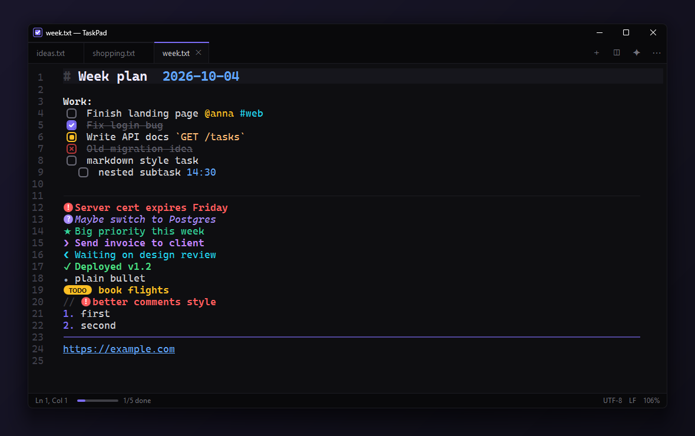
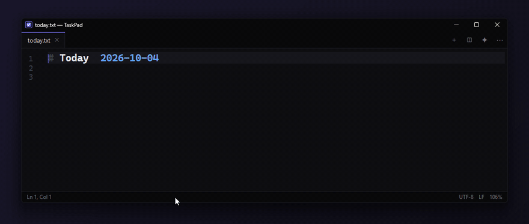
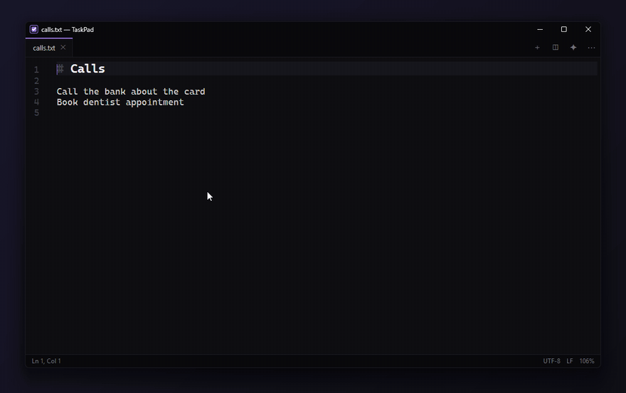
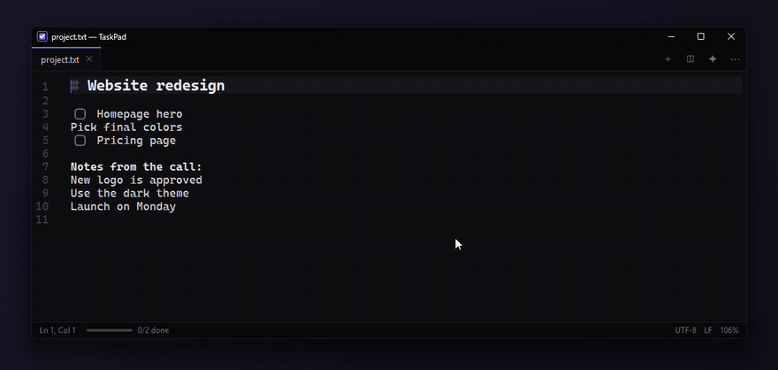
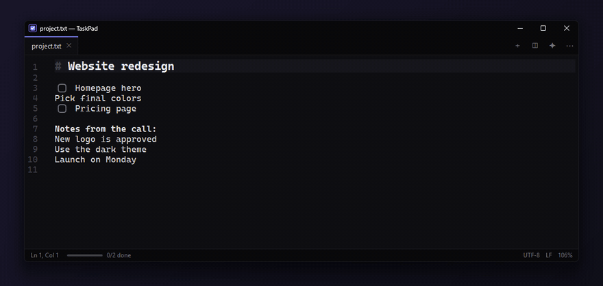
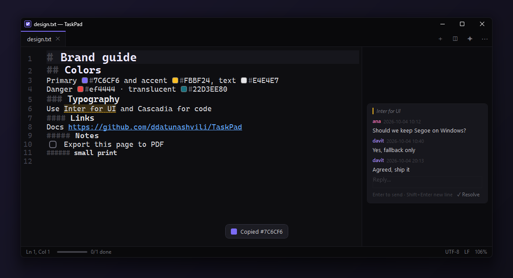
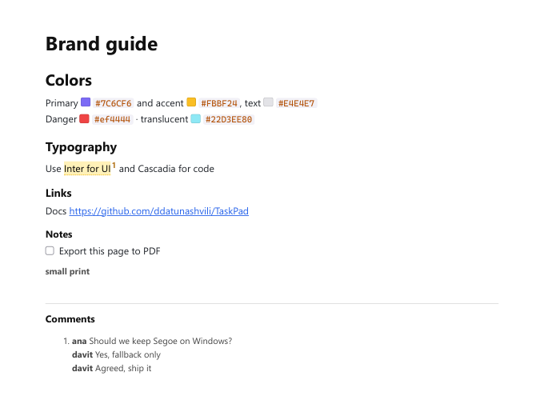
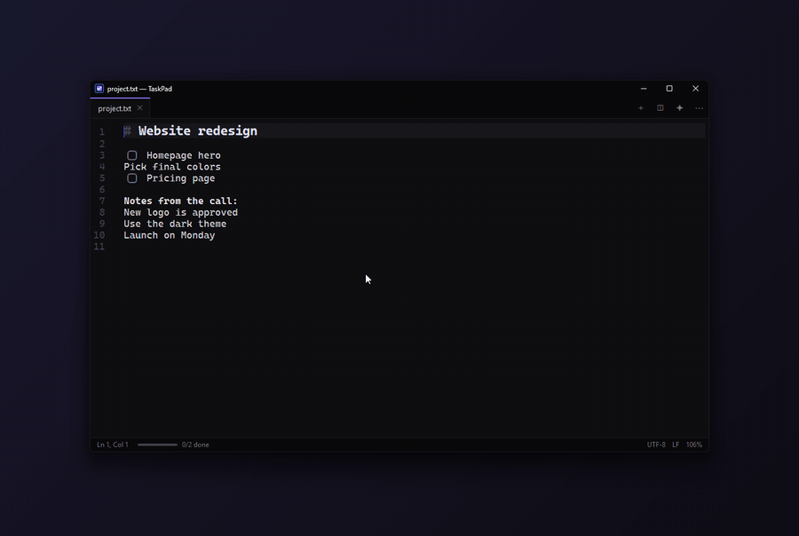
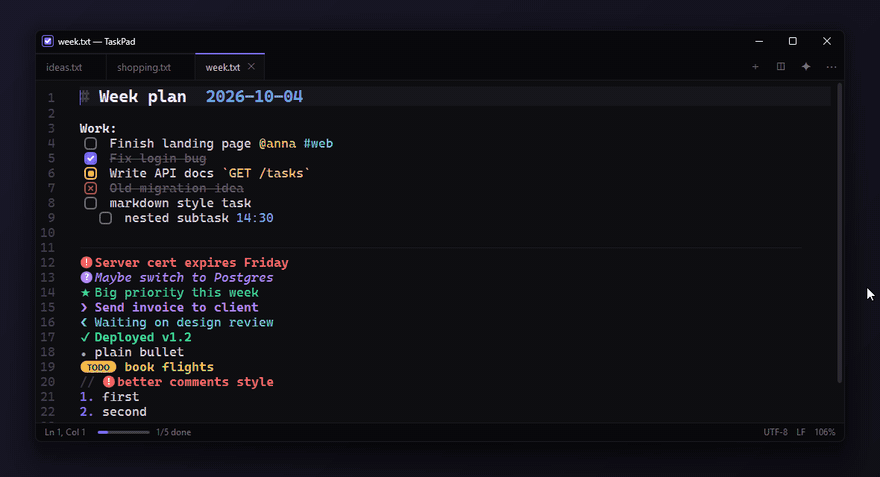
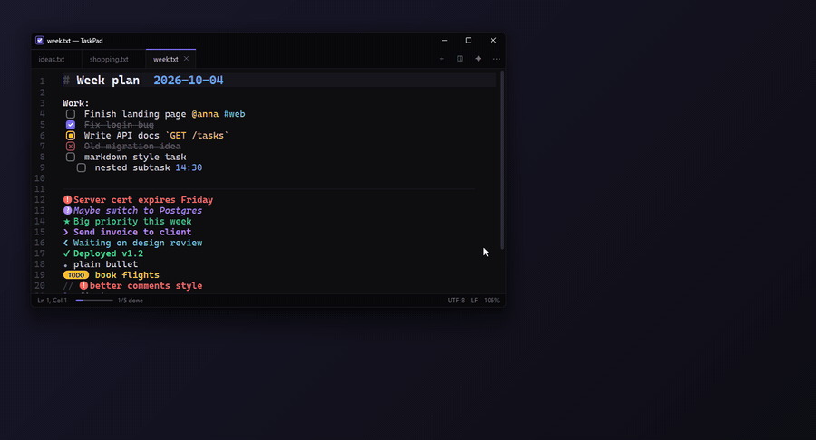

<p align="center">
  
</p>

<h1 align="center">TaskPad</h1>

<p align="center">
  A tiny, fast, VS Code-flavoured editor for plain-text task lists on Windows.<br>
  One portable <code>.exe</code> (under 1 MB). No installer, no account, your files stay <code>.txt</code>.
</p>

<p align="center">
  <a href="https://github.com/ddatunashvili/TaskPad/releases/latest/download/TaskPad-Setup.exe"><b>⬇ Install (TaskPad-Setup.exe)</b></a>
  &nbsp;·&nbsp;
  <a href="https://github.com/ddatunashvili/TaskPad/releases/latest/download/TaskPad.exe">Portable (TaskPad.exe)</a>
</p>

<p align="center">
  
</p>

## Install

**Installer** — run `TaskPad-Setup.exe`. It installs for your user only (no admin) to
`%LOCALAPPDATA%\Programs\TaskPad`, adds a Start Menu shortcut, optionally a Desktop shortcut, the Explorer
right-click entries and an **Open with** entry for `.txt`, `.md`, `.todo`, `.log`. Uninstall from
**Settings → Apps** like any other app. Running the setup again updates in place.

Silent install / uninstall: `TaskPad-Setup.exe --install --quiet` and
`%LOCALAPPDATA%\Programs\TaskPad\TaskPad.exe --uninstall --quiet`.

**Portable** — just run `TaskPad.exe` from anywhere (settings live next to it).

Both are the same program and both update themselves.

## Why

Notepad is too plain, VS Code is too heavy for a to-do list. TaskPad opens instantly from the Explorer
right-click menu and turns simple markers into checkboxes, badges and colours —
[Better Comments](https://marketplace.visualstudio.com/items?itemName=aaron-bond.better-comments) style —
while the file on disk stays plain text you can open anywhere.

## Smart typing

Type `[]` and it becomes a checkbox. Enter continues the list, Enter twice ends it. Click a box to tick it;
Ctrl+click marks it *in progress*. The status bar tracks how many tasks are done.

<p align="center"></p>

## Keywords picker

Not sure what to type? Hit <kbd>Ctrl</kbd>+<kbd>K</kbd> or the ✦ button and click a marker to apply it to the current line.

<p align="center"></p>

## Select lines, pick a style

Select several lines and a small toolbar appears: turn them all into tasks, urgent badges, stars,
a numbered list, headings… or clear the markers. Click the same style again to remove it.
<kbd>Tab</kbd> on a line under a task makes it a **subtask** with a smaller checkbox.

<p align="center"></p>

## Comments

Select words and press <kbd>Ctrl</kbd>+<kbd>M</kbd> (or **💬 Comment** in the toolbar). The text gets a soft highlight;
hover it to read the note, click the bubble to edit or delete. The box is resizable.
Stored as [CriticMarkup](https://github.com/CriticMarkup/CriticMarkup-toolkit) —
`{==text==}{>>note<<}` — so the file is still plain text.

<p align="center"></p>

### Google Docs-style margin

Prefer comments beside the text? `⋯` → **Comments in right margin** (or `commentsMode=margin` in `TaskPad.ini`).
Every thread becomes a card aligned with its line. Reply in place (Enter to send), edit ✎ or delete ✕ single messages,
**✓ Resolve** to remove the thread. Your name comes from `author=` in the ini (default: Windows user name).

<p align="center"></p>

## Colours and links

Colour codes like `#7C6CF6`, `#fff` or `#22D3EE80` get a live swatch. <kbd>Ctrl</kbd>+click a colour code or a link
to copy it — a toast confirms, and for links offers **Open ↗**.

## Export to PDF

`⋯` → **Export to PDF…** or <kbd>Ctrl</kbd>+<kbd>P</kbd>. Produces a clean, print-friendly PDF: checkboxes, badges,
headings, colour swatches, embedded images, and comments as numbered notes. Uses Microsoft Edge (built into Windows)
in the background — nothing to install.

<p align="center"></p>

## Images

<kbd>Ctrl</kbd>+<kbd>V</kbd> a screenshot or drop image files. They are saved to `images/` next to your file and
shown as a small chip (`` in the file). Hover for a preview, click to open the inspector:
wheel to zoom at the cursor, drag to pan, double-click for fit / 100 %, pixel coordinates and colour,
**📌 pin on top** to keep it as a reference while you type.

<p align="center"></p>

Want big inline thumbnails instead of chips? Set `imagePreviewHeight=160` in `TaskPad.ini`;
then hover a thumbnail to drag-resize it (stored as ``) or remove it.

## Tabs, splits and windows

Drag tabs to reorder them (they slide out of the way). Drop a tab on any edge of an editor to split,
or drop it outside the window to tear it into its own window — and drag it back to merge.

<p align="center"></p>
<p align="center"></p>

## Syntax

Type these at the start of a line:

| You type | You get |
|---|---|
| `[ ]` or `[]` | clickable checkbox |
| `[x]` | done — dimmed and struck through |
| `[/]` | in progress (<kbd>Ctrl</kbd>+click a box) |
| `[-]` | cancelled (<kbd>Shift</kbd>+click a box) |
| `- [ ]` | markdown-style task |
| `!` | red **urgent** badge |
| `?` | purple *question* badge |
| `TODO:` | amber TODO pill |
| `*` | ★ starred |
| `>` | ❯ next up |
| `<` | ❮ waiting on someone |
| `/` | ✓ finished note |
| `-` | • bullet |
| `1.` | numbered list |
| `#` … `######` | headings h1–h6 |
| `Section:` | section title |
| `---` / `===` | horizontal line |
| `// !` | Better Comments prefix also works |
| `  [ ]` (indented) | subtask, smaller box |
| `` | image chip |
| `{==text==}{>>note<<}` | commented text |

**Right-click** any checkbox or icon to switch that line to another keyword, remove it, or type your own.
Heading `#` marks stay hidden except on the line you're editing.

Inline: `@person`, `#tag`, `2026-10-04 14:30`, `` `code` `` and links (<kbd>Ctrl</kbd>+click) are coloured too.

## Keys

| Key | Action |
|---|---|
| <kbd>Enter</kbd> | continue task / bullet / numbered list (twice to end it) |
| <kbd>Ctrl</kbd>+<kbd>Enter</kbd> | toggle task on the line(s), or turn the line into a task |
| <kbd>Tab</kbd> / <kbd>Shift</kbd>+<kbd>Tab</kbd> | indent / outdent list item |
| <kbd>Alt</kbd>+<kbd>↑</kbd>/<kbd>↓</kbd> | move line |
| <kbd>Shift</kbd>+<kbd>Alt</kbd>+<kbd>↓</kbd> | duplicate line |
| <kbd>Ctrl</kbd>+<kbd>Shift</kbd>+<kbd>K</kbd> | delete line |
| <kbd>Ctrl</kbd>+<kbd>K</kbd> | keywords picker |
| <kbd>Ctrl</kbd>+<kbd>M</kbd> | comment on selection |
| <kbd>Ctrl</kbd>+<kbd>P</kbd> | export to PDF |
| <kbd>Ctrl</kbd>+click | copy colour code / link |
| <kbd>Ctrl</kbd>+<kbd>V</kbd> | paste text or an image |
| <kbd>Ctrl</kbd>+<kbd>\\</kbd> / <kbd>Ctrl</kbd>+<kbd>Shift</kbd>+<kbd>\\</kbd> | split right / down |
| <kbd>Ctrl</kbd>+<kbd>Shift</kbd>+<kbd>M</kbd> | move tab to a new window |
| <kbd>Ctrl</kbd>+<kbd>F</kbd> / <kbd>Ctrl</kbd>+<kbd>H</kbd> | find / replace |
| <kbd>F5</kbd> / <kbd>Ctrl</kbd>+<kbd>;</kbd> | insert date-time / date |
| <kbd>Ctrl</kbd>+wheel, <kbd>Ctrl</kbd>+<kbd>=</kbd>/<kbd>-</kbd>/<kbd>0</kbd> | zoom |
| <kbd>Alt</kbd>+<kbd>Z</kbd> | word wrap |
| <kbd>Ctrl</kbd>+<kbd>N</kbd>/<kbd>O</kbd>/<kbd>S</kbd>/<kbd>W</kbd>, <kbd>Ctrl</kbd>+<kbd>Tab</kbd> | the usual |
| <kbd>Ctrl</kbd>+<kbd>Shift</kbd>+<kbd>T</kbd> | reopen last closed file (↺ button lists them all) |
| <kbd>F1</kbd> | cheat sheet |

Files auto-save one second after you stop typing and reload when changed on disk.

**Nothing is lost on close.** TaskPad remembers every window, split, tab and cursor, and keeps unsaved and
untitled text in a `session` folder (saved continuously, so it even survives a crash). Close the app without
being asked anything; next time everything is back exactly as you left it. Turn off with `restoreSession=false`.

## Updates

TaskPad checks GitHub for a new release at start-up (and every few hours) and shows **Update now**. It downloads the
new `TaskPad.exe`, verifies its SHA-256 against the release notes, swaps it in place and restarts with your files.
Turn on `⋯` → **Auto-install updates** to skip the prompt, or set `autoUpdate=off` in `TaskPad.ini`.
(Needs write access to the folder the exe is in; otherwise it links to the download page.)

## Explorer right-click menu

Open the `⋯` menu → **Add to Explorer right-click menu** (or run `TaskPad.exe --register`).

- **Open with TaskPad** on `.txt`, `.md`, `.todo` and `.log` files
- **New task list (TaskPad)** on folders and folder backgrounds

It is per-user (HKCU), so no admin rights are needed. On Windows 11 the entries live under
**Show more options** (<kbd>Shift</kbd>+<kbd>F10</kbd>). Moved the exe? Register again.
`TaskPad.exe --unregister` removes everything.

## Settings

`TaskPad.ini` is created next to the exe (portable). Options: `font`, `fontSize`, `wordWrap`,
`autoSaveDelayMs`, `indentSize`, `leftMargin`, `imagePreviewHeight` (0 = chips), `commentWidth`, `commentHeight`, `commentsMode` (`hover`/`margin`),
`commentMarginWidth`, `author`, `autoUpdate` (`ask`/`auto`/`off`), `restoreSession`. Install [Comic Mono](https://dtinth.github.io/comic-mono-font/)
for the intended look; it falls back to Cascadia Mono / Consolas.

## Build

Requires the .NET SDK (any recent version) on Windows. The app targets .NET Framework 4.8, which ships with Windows 10/11,
and embeds [AvalonEdit](https://github.com/icsharpcode/AvalonEdit) so the result is a single file.

```bat
build.cmd
```

Output: `dist\TaskPad.exe`.

## License

[MIT](LICENSE)
